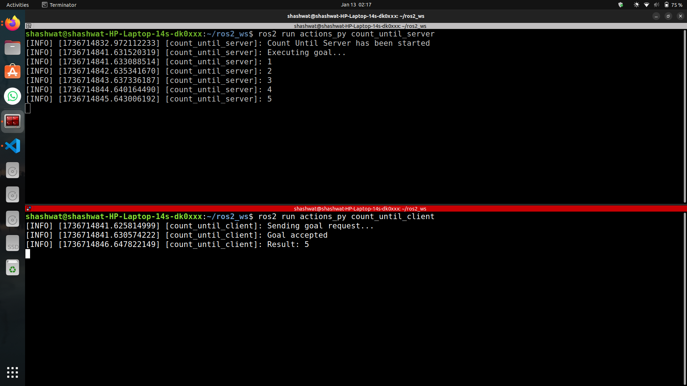
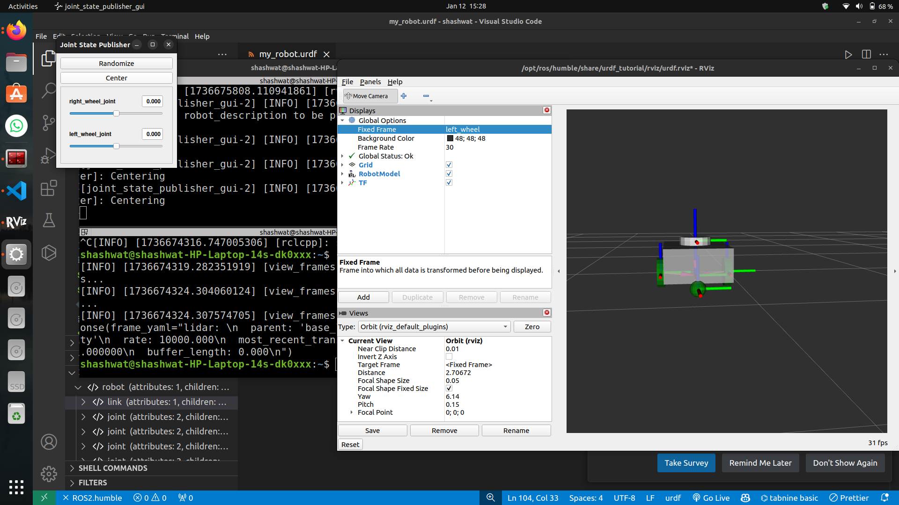
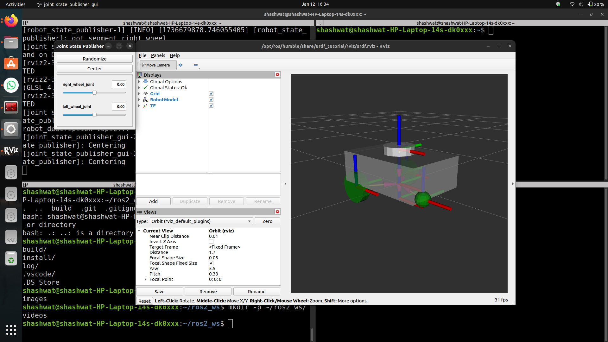
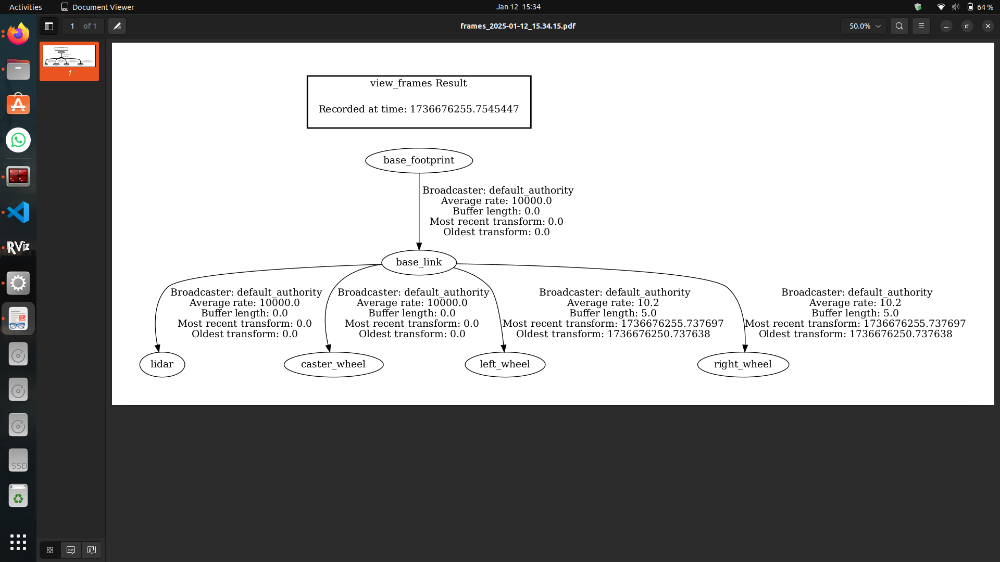

# ROS2 Humble Basics

This repository showcases different **ROS2** projects that I worked on using the **Turtlesim** simulator. The projects demonstrate basic functionalities and control techniques with ROS2.

---

## **Projects and Videos**

### **1. ROS2 Service Basics Using Turtlesim (Pen Changes Colour When Passing the Centerline)**

This project demonstrates the use of a **ROS2 service** to change the turtle's pen color when it crosses the centerline of the Turtlesim window. The pen turns red as the turtle crosses the centerline and blue as it returns.

---

### **2. ROS2 Humble Draw Circle with Turtlesim**

This project shows how to command the turtle to draw a circle using **ROS2**. It publishes velocity commands that make the turtle move in a circular path.

---

### **3. ROS2 Humble Closed Loop Turtlesim (Turtle Never Crosses the Walls and Changes Trajectory)**

In this project, the turtle moves in such a way that it never crosses the boundaries of the Turtlesim window. A **closed-loop control** mechanism adjusts its trajectory to avoid collisions with the walls.

---

### **4. ROS2 Actions: Count Until Example**

This project demonstrates the implementation of **ROS2 Actions** to perform a counting task. The action server counts up to a target number at a specified interval and provides feedback during execution. The client sends a goal with the target number and interval and receives the result when the task is completed.

**Key Features:**
- **Action Server:** Handles the counting process and sends periodic feedback.
- **Action Client:** Sends goals and retrieves results.

Below is an example image showing the output of the ROS2 Actions:

---

## **Explanation of Python Files**

### **draw_circle.py**

This file contains a ROS2 node that sends velocity commands to the turtle, making it move in a circular path using linear and angular velocities.

---

### **my_first_node.py**

This file demonstrates a simple ROS2 node that logs a counter value every second. It introduces basic functionality of creating and handling timers in ROS2.

---

### **pose_subscriber.py**

This file subscribes to the turtle's pose topic and logs its current x and y coordinates. It helps demonstrate the subscription mechanism in ROS2.

---

### **turtle_controller.py**

This file controls the turtle’s movement based on its position. The turtle adjusts its trajectory when it nears the boundaries and changes its pen color based on crossing a certain x-coordinate.

---

## **URDF and TF: Custom Robot Model**

This repository also includes a custom URDF (Unified Robot Description Format) model for a simple robot, as well as a TF (Transform Frames) visualization. 

### **URDF Robot Description**
- **Components:** The robot includes a cuboid body, two wheels, a caster wheel, and a LiDAR mounted on top.  
- **Visualization:** The URDF model can be visualized in RViz. Below are two views of the model in RViz:

  
  

---

### **TF Visualization**
The TF frames show the hierarchical structure of the robot's components. This visualization is useful for understanding how different parts are spatially related.  

---

### **Generating Maps and Navigating Turtlebot3 using Nav2**
Using Nav2 with TurtleBot3 in Gazebo, I created a map and navigated the robot through RViz. This involved setting waypoints and assigning multiple Nav2 goals to create a path. Alternatively, navigation was achieved by setting start and goal poses directly through RViz.

)

)
